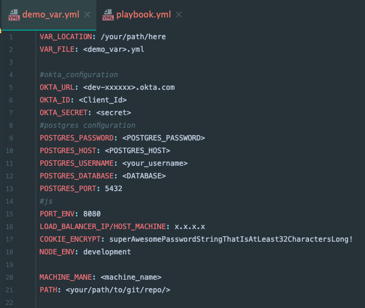

# Ansible Playbook

## Usege:

* Hosts
* Variable
* Root command
* Shell
* file
* git ==> pull
* npm
* apt

## command:

1. ROOT_PREVILAGE ==> become: yes
2. VARIABLE --> vars_files: (Secure your secret) - example below

